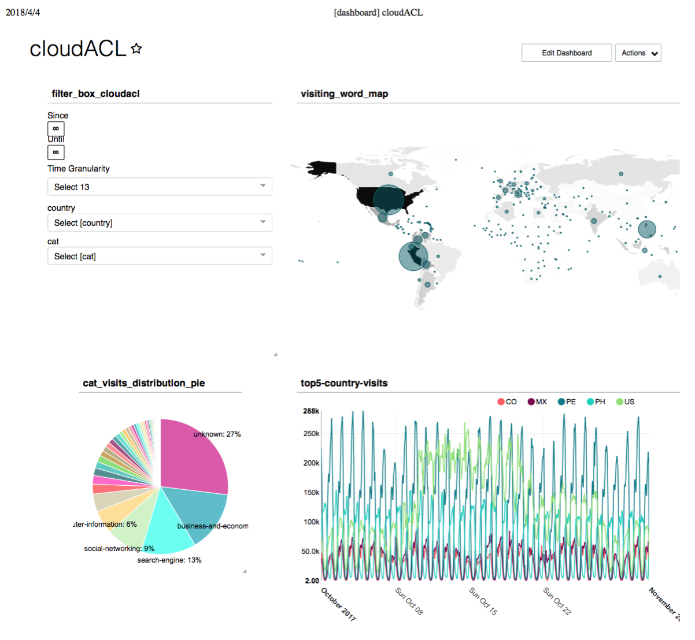

致一亩三分地： 选取这篇Repository是为了展示自己不断学习的过程，虽然工作中没有太多机会用到大数据相关的技术栈，但我仍然在业余时间自学并时刻保持好学的心态！谢谢！
# Big Data Learning on Hive, Spark, Presto, Superset(Data Visulaization)
----


# Learning Part 1
## Basic operations on Hive
### Create table and load data
1. Create a table without partition stored in textfile

	```bash
	hive> create table student_nopart(name string, age int, gpa double, gender string, state string) row format delimited fields terminated by '\t' stored as textfile;
	```
	
	Check whether table is created or not by:
	
	```bash
	hive> show tables;
	2018-03-30T19:07:18,959 INFO [pool-11-thread-1] org.apache.hadoop.hive.metastore.HiveMetaStore - 1: source:127.0.0.1 get_database: default
	2018-03-30T19:07:19,105 INFO [pool-11-thread-1] org.apache.hadoop.hive.metastore.HiveMetaStore - 1: source:127.0.0.1 get_database: default
	2018-03-30T19:07:19,122 INFO [pool-11-thread-1] org.apache.hadoop.hive.metastore.HiveMetaStore - 1: source:127.0.0.1 get_tables: db=default pat=.*
	OK
	student_nopart
	Time taken: 0.229 seconds, Fetched: 1 row(s)
    ```
    we can see table student_nopart was created successfully
2. Load local data into hive

	```bash
	hive> load data local inpath 'studentgenderstatetab10k' into table student_nopart;  
	....  
	OK
	Time taken: 1.505 seconds
	```
   check if data is loaded into hive warehouse
   
   ```bash
   hive> dfs -ls /user/hive/warehouse/student_nopart;
   Found 1 items
   -rwxr-xr-x   1 hadoop supergroup     268219 2018-03-30 19:10 /user/hive/warehouse/student_nopart/studentgenderstatetab10k
   ```
   Another way to check
   
   ```bash
   hive> select COUNT(*) from student_nopart;  
   .....
   Stage-Stage-1: Map: 1  Reduce: 1   Cumulative CPU: 4.55 sec   HDFS Read: 276442 HDFS Write: 105 SUCCESS
   Total MapReduce CPU Time Spent: 4 seconds 550 msec
   OK
   10000
   Time taken: 35.192 seconds, Fetched: 1 row(s)
   ```

### Dynamic partition during insertion
1. create a new table partitioned by column gender and state. 

	```bash
	hive> create table student_part(name string, age int, gpa double) partitioned by (gender string, state string) row format delimited fields terminated by '\t' stored as textfile;  
	....  
	2018-03-30T19:48:16,514 INFO [pool-11-thread-4] org.apache.hadoop.hive.common.FileUtils - Creating directory if it doesn't exist: hdfs://localhost:9000/user/hive/warehouse/student_part  
	OK  
	Time taken: 0.698 seconds  
	```
   
2. Load data from student_nopart into table student_part, dynamic partition

	```bash
	hive> set hive.exec.dynamic.partition.mode=nonstrict;  
	hive> insert into student_part partition(gender,state) select * from student_nopart;
	```
  
   Check the directionary struct in HDFS
   
   ```bash
   hive> dfs -ls /user/hive/warehouse/student_part;
   Found 2 items
   drwxr-xr-x   - hadoop supergroup          0 2018-03-30 20:01 /user/hive/warehouse/student_part/gender=F
   drwxr-xr-x   - hadoop supergroup          0 2018-03-30 20:01 /user/hive/warehouse/student_part/gender=M
   hive> dfs -ls /user/hive/warehouse/student_part/gender=M;
   Found 4 items
   drwxr-xr-x   - hadoop supergroup          0 2018-03-30 20:00 /user/hive/warehouse/student_part/gender=M/state=AZ
   drwxr-xr-x   - hadoop supergroup          0 2018-03-30 20:00 /user/hive/warehouse/student_part/gender=M/state=CA
   drwxr-xr-x   - hadoop supergroup          0 2018-03-30 20:00 /user/hive/warehouse/student_part/gender=M/state=FL
   drwxr-xr-x   - hadoop supergroup          0 2018-03-30 20:00 /user/hive/warehouse/student_part/gender=M/state=WA
   hive> dfs -ls /user/hive/warehouse/student_part/gender=F;
   Found 4 items
   drwxr-xr-x   - hadoop supergroup          0 2018-03-30 20:00 /user/hive/warehouse/student_part/gender=F/state=AZ
   drwxr-xr-x   - hadoop supergroup          0 2018-03-30 20:00 /user/hive/warehouse/student_part/gender=F/state=CA
   drwxr-xr-x   - hadoop supergroup          0 2018-03-30 20:00 /user/hive/warehouse/student_part/gender=F/state=FL
   drwxr-xr-x   - hadoop supergroup          0 2018-03-30 20:00 /user/hive/warehouse/student_part/gender=F/state=WA
   ```
  
3. Do a simple query

	```console
	hive> select COUNT(name) from student_part where gender = 'F' and state = 'AZ'; 
	......
	MapReduce Jobs Launched: 
	Stage-Stage-1: Map: 1  Reduce: 1   Cumulative CPU: 4.92 sec   	HDFS Read: 45557 HDFS Write: 104 SUCCESS
	Total MapReduce CPU Time Spent: 4 seconds 920 msec
	OK
	1693
	Time taken: 25.845 seconds, Fetched: 1 row(s)
	```  

### Store file 
1. Store table as ORC file

	```console
	hive> create table student_orc(name string, age int, gpa double, gender string, state string) row format delimited fields terminated by '\t' stored as orcfile;
	```
   Insert data into table
   
	```console
   hive> insert into table student_orc select * from student_part;
   ```
   
2. Check ORC file 

   ```console
   hadoop@1053d6dea9e8:/src/week3/lab1/data$ hive --orcfiledump /user/hive/warehouse/student_orc/000000_0
   ```

### Hive UDF
1. Write UDF in Eclipse. There are two UDFs:
	1. Hello from Daniel's example:

	  ```java
	  public class Hello extends UDF {
   	    public Text evaluate(Text input) {
            return new Text("Hello " + input.toString());
    	  }
	  }
	  ```
	
	2. MyUpper wrote by myself:

	  ```java
	  public class MyUpper extends UDF {
	    public Text evaluate(Text input) {
	      return new Text(input.toString().toUpperCase());
	    }
	  }
	  ```
	
2. Use UDF in Hive
	Firstly, add jar into classpath and create temporary function
	
	```console
	hive> add jar target/evalfunc-0.0.1-SNAPSHOT.jar;
	....
	Added resources: [target/evalfunc-0.0.1-SNAPSHOT.jar]
	hive> create temporary function hello as 'com.example.hive.evalfunc.Hello';
	OK
	Time taken: 0.558 seconds
	hive> create temporary function myupper as 'com.example.hive.evalfunc.MyUpper';
	OK
	Time taken: 0.011 seconds
	```
	Use UDF in query
	
	```console
	hive> select hello(myupper(name)) from student_nopart limit 10;
	.....
	OK
	Hello ULYSSES THOMPSON
	Hello KATIE CARSON
	Hello LUKE KING
	Hello HOLLY DAVIDSON
	Hello FRED MILLER
	Hello HOLLY WHITE
	Hello LUKE STEINBECK
	Hello NICK UNDERHILL
	Hello HOLLY DAVIDSON
	Hello CALVIN BROWN
	Time taken: 3.137 seconds, Fetched: 10 row(s)
	```

### HiveServer2
1. start HiveServer2 service

	```bash
	hadoop@1053d6dea9e8:/src/week3/lab1/evalfunc$ hive --service hiveserver2 &
	```
2. Connect HiveServer2 using beeline

	```console
	beeline> !connect jdbc:hive2://localhost:10000 hadoop hadoop
	Connecting to jdbc:hive2://localhost:10000
	2018-03-30T21:04:15,672 INFO [pool-11-thread-12] 	org.apache.hadoop.hive.metastore.HiveMetaStore - 12: source:	127.0.0.1 get_database: default
	2018-03-30T21:04:15,713 INFO [pool-11-thread-12] 	org.apache.hadoop.hive.metastore.HiveMetaStore - 12: Opening raw store with implementation class:org.apache.hadoop.hive.metastore.ObjectStore
	Connected to: Apache Hive (version 2.3.2)
	Driver: Hive JDBC (version 2.3.2)
	Transaction isolation: TRANSACTION_REPEATABLE_READ
	```
  
3. Show tables

	```console
	0: jdbc:hive2://localhost:10000> show tables;
	2018-03-30T21:04:24,479 INFO [pool-11-thread-12] org.apache.hadoop.hive.metastore.HiveMetaStore - 12: source:127.0.0.1 get_database: default
	2018-03-30T21:04:24,847 INFO [pool-11-thread-12] org.apache.hadoop.hive.metastore.HiveMetaStore - 12: source:127.0.0.1 get_database: default
	2018-03-30T21:04:24,862 INFO [pool-11-thread-12] org.apache.hadoop.hive.metastore.HiveMetaStore - 12: source:127.0.0.1 get_tables: db=default pat=.*
	OK
	+-----------------+
	|    tab_name     |
	+-----------------+
	| student_nopart  |
	| student_orc     |
	| student_part    |
	+-----------------+
	3 rows selected (1.858 seconds)
	```
	
	Have to say, aesthetic table makes me comfortable and happy. : ) 
	
4. Create a new table

	```console
	jdbc:hive2://localhost:10000> create table voter(name string, age int, registration string, contribution double) row format delimited fields terminated by '\t' stored as textfile;
	......
	OK
	No rows affected (0.188 seconds)
	```
	Load data into table
	
	```console
	jdbc:hive2://localhost:10000> load data inpath votertab10k into table voter;
	```
5. Do some simple queries
	1. query how many students coming from California

		```console
		jdbc:hive2://localhost:10000> select COUNT(DISTINCT(name)) as numOfCaliPerson from student_part where state = 'CA';
		......
		OK
		+------------------+
		| numofcaliperson  |
		+------------------+
		| 595              |
		+------------------+
		1 row selected (23.091 seconds)
		```
    	
	2. join table student_orc and voter
	 
		```console
		jdbc:hive2://localhost:10000> select * from student_orc s join voter v on s.name = v.name limit 10;
		......
		OK
		+------------------+--------+--------+-----------+----------+------------------+--------+-----------------+-----------------+
		|      s.name      | s.age  | s.gpa  | s.gender  | s.state  |      v.name      | v.age  | v.registration  | v.contribution  |
		+------------------+--------+--------+-----------+----------+------------------+--------+-----------------+-----------------+
		| luke king        | 65     | 0.73   | F         | AZ       | luke king        | 26     | libertarian     | 604.71          |
		| luke king        | 65     | 0.73   | F         | AZ       | luke king        | 62     | democrat        | 281.26          |
		| luke king        | 65     | 0.73   | F         | AZ       | luke king        | 56     | libertarian     | 177.84          |
		| luke king        | 65     | 0.73   | F         | AZ       | luke king        | 61     | republican      | 239.53          |
		| holly davidson   | 57     | 2.43   | F         | AZ       | holly davidson   | 59     | democrat        | 957.45          |
		| holly davidson   | 57     | 2.43   | F         | AZ       | holly davidson   | 62     | green           | 934.61          |
		| holly davidson   | 57     | 2.43   | F         | AZ       | holly davidson   | 18     | democrat        | 980.63          |
		| holly davidson   | 57     | 2.43   | F         | AZ       | holly davidson   | 61     | green           | 320.68          |
		| rachel robinson  | 62     | 2.25   | F         | AZ       | rachel robinson  | 36     | republican      | 704.71          |
		| rachel robinson  | 62     | 2.25   | F         | AZ       | rachel robinson  | 59     | democrat        | 296.66          |
		+------------------+--------+--------+-----------+----------+------------------+--------+-----------------+-----------------+
		10 rows selected (23.826 seconds)
		```
	
### Hive Window Functions 
I want to find every state's students who keep the highest GPA among their state's students.

```bash
hive> select T.name, T.state, T.gpa
    > from
    > (select name, state, gpa, rank() over(partition by state order by gpa desc) as ranking from student_orc) T
    > where T.ranking = 1;

.....

OK
nick falkner	AZ	4.0
wendy king	AZ	4.0
mike johnson	AZ	4.0
calvin brown	AZ	4.0
david allen	CA	3.99
wendy underhill	CA	3.99
sarah polk	CA	3.99
alice johnson	CA	3.99
david underhill	CA	3.99
holly brown	CA	3.99
katie thompson	CA	3.99
tom thompson	FL	4.0
calvin carson	FL	4.0
quinn van buren	FL	4.0
ulysses carson	FL	4.0
tom xylophone	WA	4.0
wendy zipper	WA	4.0
Time taken: 25.336 seconds, Fetched: 17 row(s)
```

## Basic operations on Presto
1. Start Presto server and connect it via 
	
	```bash
	presto --server localhost:8080 --catalog hive --schema default
	```
	We specify a catalog to Presto, which is hive. Presto will access Hive data via connector.

2. show tables

	```bash
	presto:default> show tables;
	.....
	     Table      
	----------------
 	bookinfo       
 	student_nopart 
 	student_orc    
 	student_part   
 	voter          
	(5 rows)

	Query 20180403_214104_00008_sr2td, FINISHED, 1 node
	Splits: 18 total, 18 done (100.00%)
	0:01 [5 rows, 135B] [7 rows/s, 197B/s]
	```
3. Do some simple query
	
	```bash
	presto:default> select * from student_orc limit 10;
	......
	        name         | age | gpa  | gender | state 
	---------------------+-----+------+--------+-------
 	luke king           |  65 | 0.73 | F      | AZ    
 	holly davidson      |  57 | 2.43 | F      | AZ    
 	rachel robinson     |  62 | 2.25 | F      | AZ    
 	gabriella van buren |  68 | 1.32 | F      | AZ    
 	bob ichabod         |  56 | 2.81 | F      | AZ    
 	bob zipper          |  40 | 0.28 | F      | AZ    
 	gabriella zipper    |  77 | 1.51 | F      | AZ    
 	zach nixon          |  74 | 2.75 | F      | AZ    
 	irene davidson      |  27 | 1.22 | F      | AZ    
 	ulysses polk        |  58 | 0.01 | F      | AZ    
	(10 rows)

	Query 20180403_214327_00009_sr2td, FINISHED, 1 node
	Splits: 18 total, 18 done (100.00%)
	0:01 [1.02K rows, 46.9KB] [1.53K rows/s, 70.2KB/s]
	```
4. Join operation

	```bash
	presto:default> select s.name, AVG(s.age) as AvgAge from student_orc s join voter v on s.name = v.name group by s.name limit 10;
	.....
	       name        |       AvgAge       
	-------------------+--------------------
 	fred garcia       |  58.46666666666667 
 	quinn garcia      | 53.473684210526315 
 	yuri robinson     |  48.07142857142857 
 	rachel laertes    |  53.13333333333333 
 	nick polk         |  47.38461538461539 
 	alice robinson    |  46.42857142857143 
 	priscilla king    |  52.36363636363637 
 	mike robinson     | 41.642857142857146 
 	fred thompson     |               49.2 
 	ulysses hernandez | 43.588235294117645 
	(10 rows)

	Query 20180403_214915_00014_sr2td, FINISHED, 1 node
	Splits: 83 total, 83 done (100.00%)
	0:01 [11K rows, 79.9KB] [11.1K rows/s, 80.5KB/s]
	```
	
## Basic operations on Spark SQL
1. Start Spark master and Spark slaves. And start Spark SQL via

	```bash
	spark-sql --master spark://1053d6dea9e8:7077
	```
2. Show tables

	```bash
	spark-sql> show tables;
	.....
	default	bookinfo	false
	default	student_nopart	false
	default	student_orc	false
	default	student_part	false
	default	voter	false
	Time taken: 0.12 seconds, Fetched 5 row(s)
	```
3. Run simple query

	```bash
	spark-sql> select * from voter where age > 50 limit 10;
	.......
	tom van buren	68	socialist	390.19
	ethan johnson	70	socialist	804.81
	irene falkner	53	republican	45.34
	victor xylophone	70	green	141.12
	nick ichabod	58	libertarian	306.16
	quinn white	52	independent	63.89
	alice van buren	63	independent	260.44
	jessica brown	53	independent	568.9
	oscar laertes	67	green	984.62
	rachel thompson	63	socialist	244.44
	Time taken: 5.102 seconds, Fetched 10 row(s)
	```
4. Join query

	```bash
	spark-sql> select s.name, AVG(s.age) as AvgAge from student_orc s join voter v on s.name = v.name group by s.name limit 10;
	........
	xavier white	51.84615384615385
	irene robinson	48.21052631578947
	wendy underhill	49.90909090909091
	nick falkner	45.63636363636363
	gabriella quirinius	55.0
	wendy quirinius	47.523809523809526
	yuri robinson	48.07142857142857
	nick ellison	55.833333333333336
	ulysses nixon	46.46666666666667
	zach falkner	59.5
	Time taken: 4.063 seconds, Fetched 10 row(s)
	```
5. Spark SQL can reuse Hive's UDF, let's try it

	```bash
	spark-sql> add jar /src/week3/lab1/evalfunc/target/evalfunc-0.0.1-SNAPSHOT.jar;
	spark-sql> create temporary function Hello as 'com.example.hive.evalfunc.Hello';
	spark-sql> create temporary function Upper as 'com.example.hive.evalfunc.MyUpper';
	spark-sql> select Hello(Upper(name)) from student_orc limit 10;
	......
	Hello LUKE KING
	Hello HOLLY DAVIDSON
	Hello RACHEL ROBINSON
	Hello GABRIELLA VAN BUREN
	Hello BOB ICHABOD
	Hello BOB ZIPPER
	Hello GABRIELLA ZIPPER
	Hello ZACH NIXON
	Hello IRENE DAVIDSON
	Hello ULYSSES POLK
	Time taken: 1.004 seconds, Fetched 10 row(s)
	```

## Realtime Log Ingestion using Flink
1. Firstly, create a table named access_log_partitioned in Hive
	
	```bash
	hive> create table access_log_partitioned(country string, dt timestamp, cat string, count int) partitioned by (d date) row format delimited fields terminated by '\t' stored as textfile;
	```
	Set up SERDE property for table access_log_partitioned, so that it can know use what format to deal with timestamp field
	
	```bash
	hive> alter table access_log_partitioned set SERDEPROPERTIES ('timestamp.formats'='yyyy-MM-dd HH:mm:ss');
	```
	Add a new partitions, where flink will feed data into
	
	```bash
	hive> alter table access_log_partitioned add partition(d='2017-11-01');
	```
	Check Hive warehouse in HDFS
	
	```bash
	hive> dfs -ls /user/hive/warehouse/access_log_partitioned;
	Found 1 items
	drwxr-xr-x   - hadoop supergroup          0 2018-04-03 23:19 /user/hive/warehouse/access_log_partitioned/d=2017-11-01
	```
2. Run flink and submit job

	```bash
	hadoop@1053d6dea9e8:/src/week3/lab2/flink$ flink run --class com.example.flink.Ingestion --classpath file:///$PWD/resource/geoip-api-1.3.1.jar target/hourlyinjestion-0.0.1-SNAPSHOT.jar 
	```
3. Simulate log growing using python script

	```bash
	hadoop@1053d6dea9e8:/src/week3/lab2/flink/log$ python process.py sample.txt > /mnt/access_log/localhost_access_log.2018-04-03.txt 
	```
4. Check whether there are data coming into HDFS or not
	
	```bash
	hive> dfs -ls /user/hive/warehouse/access_log_partitioned/d=2017-11-01;
	Found 1904 items
	-rw-r--r--   1 hadoop supergroup         37 2018-04-03 23:35 /user/hive/warehouse/access_log_partitioned/d=2017-11-01/AE_02_real-estate
	-rw-r--r--   1 hadoop supergroup         34 2018-04-03 23:35 /user/hive/warehouse/access_log_partitioned/d=2017-11-01/AE_02_shopping
	-rw-r--r--   1 hadoop supergroup         33 2018-04-03 23:36 /user/hive/warehouse/access_log_partitioned/d=2017-11-01/AE_10_society
	-rw-r--r--   1 hadoop supergroup         32 2018-04-03 23:36 /user/hive/warehouse/access_log_partitioned/d=2017-11-01/AE_10_travel
	-rw-r--r--   1 hadoop supergroup         43 2018-04-03 23:37 /user/hive/warehouse/access_log_partitioned/d=2017-11-01/AE_12_social-networking
	-rw-r--r--   1 hadoop supergroup         33 2018-04-03 23:37 /user/hive/warehouse/access_log_partitioned/d=2017-11-01/AE_12_unknown
	-rw-r--r--   1 hadoop supergroup         43 2018-04-03 23:38 /user/hive/warehouse/access_log_partitioned/d=2017-11-01/AE_14_financial-service
	-rw-r--r--   1 hadoop supergroup         33 2018-04-03 23:34 /user/hive/warehouse/access_log_partitioned/d=2017-11-01/AM_00_unknown
	-rw-r--r--   1 hadoop supergroup         33 2018-04-03 23:37 /user/hive/warehouse/access_log_partitioned/d=2017-11-01/AM_11_unknown
	-rw-r--r--   1 hadoop supergroup         46 2018-04-03 23:36 /user/hive/warehouse/access_log_partitioned/d=2017-11-01/AP_09_business-and-economy
	-rw-r--r--   1 hadoop supergroup         33 2018-04-03 23:37 /user/hive/warehouse/access_log_partitioned/d=2017-11-01/AP_11_unknown
	-rw-r--r--   1 hadoop supergroup         34 2018-04-03 23:34 /user/hive/warehouse/access_log_partitioned/d=2017-11-01/AR_00_auctions
	-rw-r--r--   1 hadoop supergroup         46 2018-04-03 23:34 /user/hive/warehouse/access_log_partitioned/d=2017-11-01/AR_00_business-and-economy
	......
	```
	
5. Yeah, we can see lots of data are flowing into Hive warehouse

	```bash
	hive> select * from access_log_partitioned limit 50;
	OK
	AE	2017-11-01 02:00:00	real-estate	1	2017-11-01
	AE	2017-11-01 02:00:00	shopping	1	2017-11-01
	AM	2017-11-01 00:00:00	unknown	1	2017-11-01
	AR	2017-11-01 00:00:00	auctions	1	2017-11-01
	AR	2017-11-01 00:00:00	business-and-economy	1	2017-11-01
	AR	2017-11-01 00:00:00	computer-information	1	2017-11-01
	AR	2017-11-01 00:00:00	healthy-and-medicine	1	2017-11-01
	AR	2017-11-01 00:00:00	search-engine	2	2017-11-01
	AR	2017-11-01 00:00:00	shopping	1	2017-11-01
	AR	2017-11-01 00:00:00	software-download	1	2017-11-01
	AR	2017-11-01 00:00:00	travel	1	2017-11-01
	AR	2017-11-01 00:00:00	unknown	2	2017-11-01
	AR	2017-11-01 01:00:00	business-and-economy	2	2017-11-01
	AR	2017-11-01 01:00:00	entertainment-and-art	1	2017-11-01
	AR	2017-11-01 01:00:00	internet-communication	1	2017-11-01
	AR	2017-11-01 01:00:00	internet-portal	1	2017-11-01
	AR	2017-11-01 01:00:00	search-engine	3	2017-11-01
	AR	2017-11-01 01:00:00	unknown	2	2017-11-01
	AR	2017-11-01 02:00:00	government	1	2017-11-01
	AR	2017-11-01 02:00:00	unknown	1	2017-11-01
	AR	2017-11-01 03:00:00	business-and-economy	1	2017-11-01
	AR	2017-11-01 03:00:00	computer-information	1	2017-11-01
	AR	2017-11-01 03:00:00	financial-service	1	2017-11-01
	AR	2017-11-01 03:00:00	search-engine	2	2017-11-01
	AR	2017-11-01 03:00:00	unknown	1	2017-11-01
	AR	2017-11-01 04:00:00	unknown	1	2017-11-01
	AR	2017-11-01 05:00:00	search-engine	1	2017-11-01
	AR	2017-11-01 05:00:00	unknown	1	2017-11-01
	AR	2017-11-01 06:00:00	search-engine	1	2017-11-01
	AU	2017-11-01 00:00:00	entertainment-and-art	1	2017-11-01
	AU	2017-11-01 00:00:00	search-engine	1	2017-11-01
	AU	2017-11-01 01:00:00	search-engine	1	2017-11-01
	AU	2017-11-01 02:00:00	web-mail	1	2017-11-01
	AU	2017-11-01 03:00:00	business-and-economy	1	2017-11-01
	AU	2017-11-01 03:00:00	computer-information	1	2017-11-01
	AU	2017-11-01 03:00:00	healthy-and-medicine	1	2017-11-01
	AU	2017-11-01 03:00:00	real-estate	1	2017-11-01
	AU	2017-11-01 04:00:00	financial-service	1	2017-11-01
	AU	2017-11-01 05:00:00	entertainment-and-art	1	2017-11-01
	AU	2017-11-01 05:00:00	unknown	1	2017-11-01
	BB	2017-11-01 02:00:00	search-engine	1	2017-11-01
	BD	2017-11-01 01:00:00	personal-site-and-blog	1	2017-11-01
	BD	2017-11-01 04:00:00	computer-information	1	2017-11-01
	BD	2017-11-01 04:00:00	financial-service	1	2017-11-01
	BD	2017-11-01 05:00:00	unknown	1	2017-11-01
	BD	2017-11-01 06:00:00	online-advertisement	1	2017-11-01
	BE	2017-11-01 04:00:00	unknown	1	2017-11-01
	BH	2017-11-01 04:00:00	entertainment-and-art	1	2017-11-01
	BN	2017-11-01 00:00:00	unknown	1	2017-11-01
	BN	2017-11-01 03:00:00	computer-information	1	2017-11-01
	Time taken: 0.306 seconds, Fetched: 50 row(s)

	``` 

## Data analysis by Hive
As Flink process tons of data every second, our Hive's access_log table grows very quickly. The next job, we will use Hive to do some analysis on those data.  

1. Put history log into access log table and put all data from access log into table access log partitioned
2. Create country mapping table and load local data into it
3. Find the busiest hour

	```bash
	--- Firstly we can group by hour, and count its frenquency and further sort it by frenquency  
	--- Then we take the top one record.
	hive> select hour(dt), count(*) cnt from access_log_partitioned group by hour(dt) order by cnt desc limit 1;
	....
	OK
	14	128765
	```
4. Find Countries which have more than average total visits

	```bash
	--- Firstly, find out average visits
	hive> select AVG(a.visits)
    > from
    > (select country, SUM(count) as visits from access_log_partitioned group by country) a;
    ......
    OK
	2356731.371681416
	
	--- Then, Find Countries which have more than average total visits
	hive> select country, SUM(count) visits
    > from access_log_partitioned
    > group by country
    > having visits > 2356731.371681416;
    ...
    OK
	AR	12022976
	AU	3568988
	BO	17605652
	BR	4867771
	CA	7542249
	CL	5227759
	CO	21391952
	DE	7828091
	DO	2438458
	DZ	6484983
	EC	12835092
	EG	5296202
	ES	8281273
	FR	11461862
	GB	8044593
	GT	2424293
	ID	10870138
	IL	2570654
	IN	12021301
	IT	18015359
	MX	23807685
	NL	3147264
	PE	85283216
	PH	50572854
	PL	6718559
	RO	3447958
	RU	7740110
	TR	4086138
	US	90079276
	VE	14599674
	```
5. Join with country_mapping

	```bash
	hive> select c.country, v.visits
    	> from (select country, SUM(count) visits from access_log_partitioned group by country having visits > 2356731.371681416) v 
    	> join country_mapping c on v.country = c.code
    	> order by v.visits desc;
    ......
    OK
	United States	90079276
	Peru	85283216
	Philippines	50572854
	Mexico	23807685
	Colombia	21391952
	Italy	18015359
	Bolivia	17605652
	Venezuela	14599674
	Ecuador	12835092
	Argentina	12022976
	India	12021301
	France	11461862
	Indonesia	10870138
	Spain	8281273
	United Kingdom	8044593
	Germany	7828091
	Russia	7740110
	Canada	7542249
	Poland	6718559
	Algeria	6484983
	Egypt	5296202
	Chile	5227759
	Brazil	4867771
	Turkey	4086138
	Australia	3568988
	Romania	3447958
	Netherlands	3147264
	Israel	2570654
	Dominican Republic	2438458
	Guatemala	2424293
	```
	
## Data Visulaization using Superset
Built some viz charts, timelines based on access_log_partitioned table, and built a dashboard to display them.

	
	
# Learning Part 2
1. **Write a Hive windowing function query to rank country by count within every day**  
	Firstly, We need to count every country's daily visits. We can use group by function to do this count.  
	Then we use a window functions rank() over a window partitioned by date with descending orders on country's daily visits.
	
	```bash
	jdbc:hive2://localhost:10000> 
	. . . > select T.d, c.country, T.visits, rank() over(partition by T.d order by T.visits desc) as rank
	. . . > from (select d, country, SUM(count) visits from access_log_partitioned group by d,country) T 
	. . . > join country_mapping c on c.code=T.country;
	......
	OK
	+-------------+-----------------------------------+-----------+-------+
	|     t.d     |             c.country             | t.visits  | rank  |
	+-------------+-----------------------------------+-----------+-------+
	| 2017-09-30  | Peru                              | 35        | 1     |
	| 2017-09-30  | United States                     | 9         | 2     |
	| 2017-09-30  | Germany                           | 4         | 3     |
	| 2017-09-30  | Colombia                          | 4         | 3     |
	| 2017-09-30  | Argentina                         | 4         | 3     |
	| 2017-09-30  | Ecuador                           | 3         | 6     |
	| 2017-09-30  | Mexico                            | 3         | 6     |
	| 2017-09-30  | Venezuela                         | 3         | 6     |
	| 2017-09-30  | Philippines                       | 3         | 6     |
	| 2017-09-30  | Bolivia                           | 3         | 6     |
	| 2017-09-30  | Canada                            | 2         | 11    |
	| 2017-09-30  | United Kingdom                    | 2         | 11    |
	| 2017-09-30  | Malaysia                          | 2         | 11    |
	| 2017-09-30  | Chile                             | 2         | 11    |
	| 2017-09-30  | Israel                            | 1         | 15    |
	| 2017-09-30  | Italy                             | 1         | 15    |
	| 2017-09-30  | Morocco                           | 1         | 15    |
	| 2017-09-30  | Singapore                         | 1         | 15    |
	| 2017-09-30  | Romania                           | 1         | 15    |
	| 2017-09-30  | Australia                         | 1         | 15    |
	| 2017-10-01  | Peru                              | 2690525   | 1     |
	| 2017-10-01  | Philippines                       | 1750802   | 2     |
	| 2017-10-01  | United States                     | 1287871   | 3     |
	| 2017-10-01  | Mexico                            | 549741    | 4     |
	| 2017-10-01  | Colombia                          | 544513    | 5     |
	| 2017-10-01  | Ecuador                           | 502115    | 6     |
	| 2017-10-01  | Bolivia                           | 453835    | 7     |
	| 2017-10-01  | France                            | 387293    | 8     |
	| 2017-10-01  | India                             | 370591    | 9     |
	| 2017-10-01  | Venezuela                         | 331311    | 10    |
	| 2017-10-01  | Argentina                         | 322516    | 11    |
	| 2017-10-01  | Indonesia                         | 290125    | 12    |
	| 2017-10-01  | Spain                             | 256080    | 13    |
	| 2017-10-01  | Germany                           | 254847    | 14    |
	| 2017-10-01  | United Kingdom                    | 250834    | 15    |
	| 2017-10-01  | Algeria                           | 237420    | 16    |
	| 2017-10-01  | Russia                            | 230438    | 17    |
	| 2017-10-01  | Canada                            | 215608    | 18    |
	| 2017-10-01  | Italy                             | 210959    | 19    |
	| 2017-10-01  | Poland                            | 209299    | 20    |
	| 2017-10-01  | Egypt                             | 165588    | 21    |
	| 2017-10-01  | Turkey                            | 136573    | 22    |
	.......
	```
	
2. **Write a Hive query to find out the second largest category visited during the busiest day of the month**  
	Firstly, We need to find the biggest day of every month:
	
	```bash
	jdbc:hive2://localhost:10000> 
	. . . > select T2.m, T2.day
	. . . > from (
	. . . > select T1.m, T1.day, T1.visits, rank() over(partition by T1.m order by T1.visits desc) as rank 
	. . . > from (select month(dt) m, day(dt) day, SUM(count) visits from access_log_partitioned group by month(dt),day(dt)) T1
	. . . > ) T2
	. . . > where rank = 1;
	
	....
	OK
	+-------+---------+
	| t2.m  | t2.day  |
	+-------+---------+
	| 9     | 30      |
	| 10    | 16      |
	| 11    | 1       |
	+-------+---------+
	```
	
	We can store this SQL as a view named busistDay, and we do further queries on this view.
	
	```bash
	jdbc:hive2://localhost:10000> 
	. . . > create VIEW busistDay
	. . . > as
	. . . > select T2.m, T2.day 
	. . . > from (
	. . . > select T1.m, T1.day, T1.visits, rank() over(partition by T1.m order by T1.visits desc) as rank 
	. . . > from (select month(dt) m, day(dt) day, SUM(count) visits from access_log_partitioned group by month(dt),day(dt)) T1
	. . . > ) T2 
	. . . > where rank = 1;
	```
	Secondly we need to retrieve all visiting records happened on busist day of the month, and in order to reuse in further query, we store the result as view again.
	
	```bash
	jdbc:hive2://localhost:10000>
	. . . > create VIEW visitingRecords
	. . . > as
	. . . > select a.cat cat, a.count count, b.m month, b.day day 
	. . . > from access_log_partitioned a join busistDay b 
	. . . > on month(a.dt)=b.m and day(a.dt)=b.day
	``` 
	Then we can query on this view and find the second largest category visited via window function rank()
	
	```bash
	0: jdbc:hive2://localhost:10000> 
	. . .> select T2.cat, T2.visits, T2.month, T2.day
	. . .> from (
	. . .> select T1.cat, T1.visits, T1.month, T1.day, dense_rank() over(partition by T1.month, T1.day order by T1.visits desc) as rank 
	. . .> from (select cat, SUM(count) as visits, month, day from visitingRecords group by cat,month,day) T1
	. . .> ) T2
	. . .> where T2.rank = 2;
	.....
	OK
	+-----------------------+------------+-----------+---------+
	|        t2.cat         | t2.visits  | t2.month  | t2.day  |
	+-----------------------+------------+-----------+---------+
	| search-engine         | 14         | 9         | 30      |
	| business-and-economy  | 2872456    | 10        | 16      |
	| unknown               | 8          | 11        | 1       |
	+-----------------------+------------+-----------+---------+
	```


